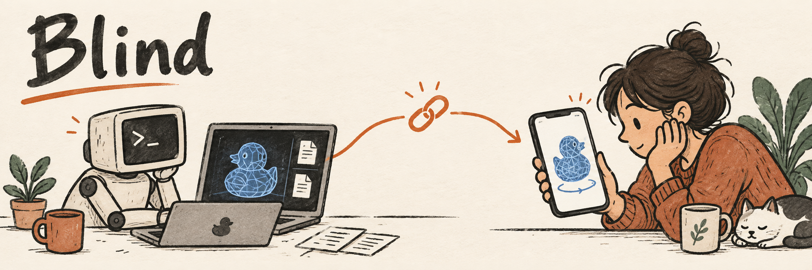

# Blind

**From your terminal to a shared 3D view.**

[](https://github.com/hx-w/blind/releases/latest)
[](#quick-start)
[](LICENSE)

Blind turns meshes, notes and diagnostics into a link you can open on a phone
or desktop. An agent can create the scene from the CLI; a person can rotate,
inspect, annotate and share what they see.

- Rotate the model, inspect a section, or mark a detail directly on its surface.
- Put Markdown, JSON, images and logs beside the geometry for context.
- Share the view and its PNG. Original files stay on their source machine or object store.

## Quick start

Install the latest release on macOS (Apple Silicon or Intel) or Linux x86_64:

```sh
curl -fsSL https://raw.githubusercontent.com/hx-w/blind/main/install.sh | sh
```

Start the server:

```sh
blind serve
```

In another terminal on the same machine, as the same user, register locally
and share a small sample mesh:

```sh
blind join --local
curl -fsSLo demo.ply https://raw.githubusercontent.com/hx-w/blind/main/tests/fixtures/tetra.ply
blind share demo.ply --format json
```

Open `viewer_url` in your browser, or on a phone that can reach this machine.
Use `image_url` for a PNG of the same view. Keep `owner_url` private.
Replace `demo.ply` with your own PLY, STL, OBJ or PTS file.

Already using a team server? Follow [Client registration](docs/client-server.md#registration)
instead. To host one, see [team server setup](docs/client-server.md#start-a-team-server).

## Bring the context

```sh
blind share model.ply notes.md metrics.json --format json
blind share --config collection.json --format json
```

Documents open alongside the model. Collections keep several independent scenes
under one link. See [components](docs/components.md) and
[collection configuration](docs/cli.md#collections) for examples.

Links last seven days by default and depend on their original sources remaining
available and unchanged. [Sharing and link lifetime](docs/cli.md#links-and-lifetimes)
explains permanent links, reshares and source changes.

## Documentation

| I want to… | Guide |
| --- | --- |
| Share files, label groups, script an agent or create collections | [CLI guide](docs/cli.md) |
| Inspect, annotate, compare sections or use the viewer on a phone | [Viewer guide](docs/viewer.md) |
| Display Markdown, JSON, images, HTML or custom content | [Scene components](docs/components.md) |
| Set up a team server, connect machines, update or troubleshoot | [Client and Server](docs/client-server.md) |
| Read from S3-compatible storage or signed download domains | [Object storage](docs/oss.md) |
| Extend Blind with server-side resolvers and renderers | [Plugins](docs/plugins.md) |
| Integrate with HTTP or understand saved scene state | [API](docs/api.md) · [Sharing contract](docs/sharing.md) |
| Build, test or contribute | [Development](docs/development.md) · [Architecture](docs/architecture.md) |

[Releases](https://github.com/hx-w/blind/releases) · [Changelog](CHANGELOG.md) ·
[Security](SECURITY.md) · [MIT license](LICENSE)
